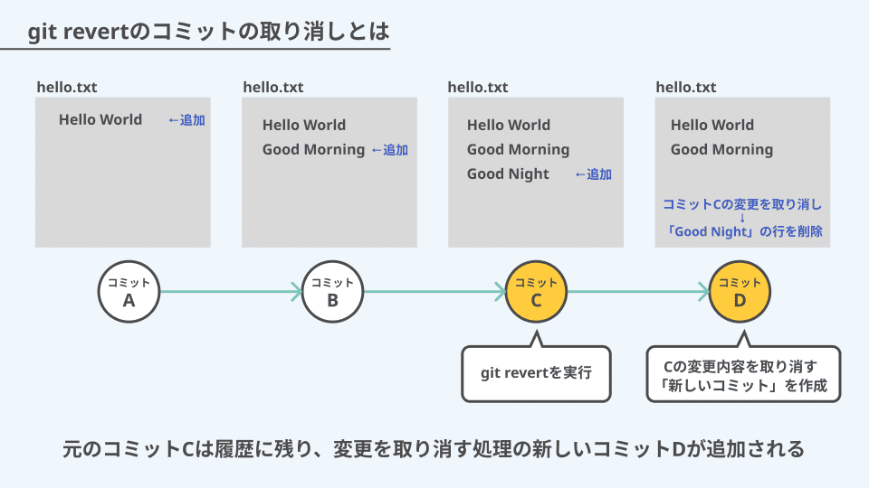
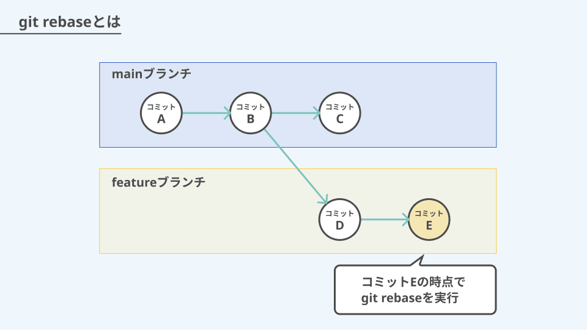
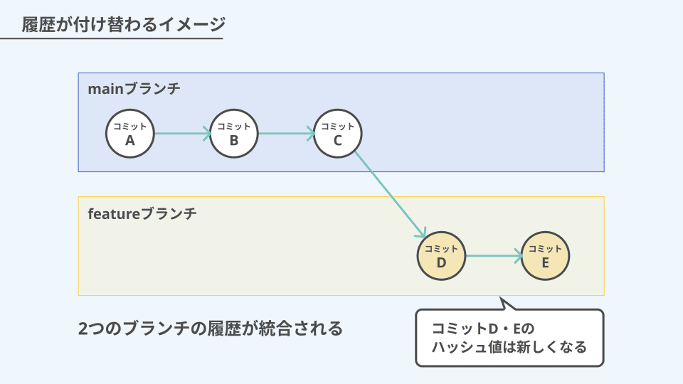

# 目次

1. [revert とは](#revert-とは)
1. [rebase とは](#rebase-とは)
1. [revert rebase の違い](#revert-と-rebase-の違い)
1. [長所・短所まとめ](#長所・短所まとめ)

# revert とは

**既存のコミットを取り消すためのコマンド**

「取り消したいコミットを打ち消すようなコミットを新しく作成する」という処理によって、既存のコミットを取り消す。

**<u>変更を取り消した」という記録を残すのが大きな特徴</u>**



## git revert コマンドの主な用途

`git revert` は、主に次のような場面で活躍する。

- リモートに push 済みのコミットを、履歴を壊さずに取り消したいとき
- チーム全員に「どの変更を取り消したか」という記録を残す必要がある場合
- 共有ブランチ内でコミットを取り消す際に、他の人の作業に影響を与えず元に戻したいとき

<u>QA,履歴を壊すとは？</u>

リモートの履歴

```
A --- B --- C --- D (main)
```

自身がローカルで書き換えて強制 push した後

```
A --- B --- X --- Y (main)  ← CとDが無かったことになる
```

GitHub 上から見ると C と D が消える、つまり

コミット ID が変わってしまう

他の人がその履歴を取り込んでいた場合、整合しなくなる

→ これが「履歴が壊れる」状態。

他の人が C, D を元に作業していた場合、
あなたが履歴を書き換えたあとに push すると

- pull できない

- push できない

- コンフリクトが大量発生

チーム開発ではこれが大事故に繋がる。

## 使用コマンド

### ① 単一コミットを戻す

```
git revert <commitId>
```

→ 対象コミットを打ち消す新コミットが作成される

- 最新コミットを打ち消す場合は`HEAD`を使っても実行できる

  ```
  git revert HEAD~1
  ```

- `-e`を書き加えると自分の言葉でメッセージを書けるようになる

  ```
  git revert -e <commitId>
  ```

  ターミナルに以下のような文が出るので、必要ならコメント内容を手動で修正する

  ```
  Revert "Fix: update payment logic"

  Reason:
  - Caused regression in subscription flow on 2025-11-02
  - Incident ID #4421
  - Will re-apply after root cause fix
  ```

### ② 複数コミットをまとめて戻す

```
git revert <commitIdA> <commitIdB> <commitIdC>
```

※複数コミットの rebase 時に以下コマンドも状況に合わせて使用することもできる

- **全部なかったことにしたい（やり直し）**

  ```
  git revert --abort
  ```

  → 進行中の revert を中止したいときに使う

- **一部だけ飛ばして進めたい**

  ```
  git revert --skip
  ```

  → 対象コミットが複数で、特定のコミットは飛ばしたいときに使う

### ③ 直前の revert をやっぱり取り消したい（“revert の revert”）

```
git revert <revert_commitId>
```

→ もとの変更を「復活」させるイメージ

# rebase とは

**ブランチの履歴を付け替え（付け直し）するためのコマンド**

ブランチの履歴を付け替えて直線的に並べ直すことで、履歴をきれいに整理できる

1/2



2/2



## **rebase の主な使用用途**

`git rebase` は、主に次のような場面で活躍する。

- PR（Pull Request）を出す前に余計なコミットや雑な履歴を整理したい
- コミットコメントの修正や、コミットの削除を行いたい
- コミット順を並べ替えたい

## 使用コマンド

### ① 他人の最新変更を取り込む（履歴を綺麗に保つ）

自分の feature が古いとき → 自分の変更が main の後ろにきれいに並ぶ

```
git checkout feature
git fetch origin
git rebase origin/main
```

## ② 作成したコミットの内容を整理する（修正、削除等）

現在ブランチの親を基準にして、指定したコミット範囲だけを並べ替えたいときは`rebase -i HEAD~`を使って変更することが出来る

直近の 5 コミットを編集するケース

```
git rebase -i HEAD~5
```

※ i は Interactive rebase の略称で、コミットを別ブランチの先頭に乗せるときに、どのように乗せるかを指定できるモード

実行後、エディタが開き、こう表示される

```
pick abc123   add user model
pick dce456   fix typo
pick ef7890   debug
```

ここで操作できる選択肢一覧

| コマンド | 内容                     |
| -------- | ------------------------ |
| `pick`   | そのまま使う             |
| `reword` | メッセージを書き換える   |
| `edit`   | コミットの内容を修正する |
| `squash` | 前のコミットにまとめる   |
| `drop`   | コミットを削除する       |

- **rebase i 実行中にやっぱやめたい場合**

  ```
  git rebase --abort
  ```

- **編集が完了して反映させたい場合**

  ```
  git push --force-with-lease
  ```

※ force-with-lease とは PUSH の際、ローカル ref とリモート ref を比較しローカルが最新か判定し、最新でなければ PUSH が失敗するというもの。

### <span style="color: red; font-weight: bold;">`git push --force` は基本つかわないこと</span>

rebase は以下の条件を満たした場合のみ使用すること

- 自分だけが触っているブランチの場合
- push 後すぐ、まだ誰も触っていない
- 他の作業者が pull する可能性がない場合

### rebase と rebase i の違いとは

| コマンド      | 何をする？                                             | 主な目的                                              |
| ------------- | ------------------------------------------------------ | ----------------------------------------------------- |
| git rebase    | 親（ベース）を付け替える。履歴をまっすぐに並べ直す。   | 最新ブランチへ追従 / merge を使わず履歴を綺麗にしたい |
| git rebase -i | 付け替えに加えて、過去コミットを対話形式で編集できる。 | コミット整理・削除・まとめ・メッセージ修正            |

<u>※ローカルブランチにて作成した範囲のコミットのみを編集したい場合は、`HEAD~`で指定する</u>

### 図解

```
(main)     A ─ B ─ C ─ D
　　　　　　　　　 \
(feature)          E ─ F ─ G

```

E, F, G はローカルで作ったコミット

A, B, C, D は元からあった履歴

- **git rebase -i HEAD~3 の場合**

  - 対象は E, F, G のみ（ローカルの直近 3 つを指定したため）
  - A, B, C, D は触れない
  - 変更できるのは「自分が作った 3 つ」だけ

- **git rebase -i main の場合**

  - 対象は D ,E, F, G で main の最後のコミットも対象になる
  - feature の全履歴を main の上に積み直す rebase
  - -i 付きなので 途中のコミットがすべて編集対象になる

- **git rebase -i --root の場合(補足)**

  - リポジトリ最初のコミットから全部が対象(A, B, C, D ,E, F, G)

`git rebase i`はベースの付け替えに加えて、コミットの内容を編集することが可能だが、自分が作成したコミット以外、

つまり親ブランチにマージされたコミットの内容を書き換えることは危険なため、使用する場合は HEAD~で必ず指定すること。

# revert と rebase の違い

| コマンド | なにをする？                       | 履歴をどう扱う？                                            |
| -------- | ---------------------------------- | ----------------------------------------------------------- |
| revert   | 過去の変更を“打ち消す”             | ❌ 履歴は消さない → ✅「打ち消しコミット」を追加            |
| rebase   | 過去の履歴を“付け替え・書き換える” | ✅ コミット自体を再生成・削除・修正する（履歴を書き換える） |

- `revert` ＝歴史はそのまま、結果だけ元に戻す

- `rebase` ＝歴史ごと修正、きれいな履歴にできる

# 長所・短所まとめ

| 項目               | revert             | rebase                          |
| ------------------ | ------------------ | ------------------------------- |
| 履歴               | 残す（追加される） | 書き換える                      |
| 安全性             | ✅ 高い            | ❌ 扱い間違うと危険             |
| PR の綺麗さ        | ❌ 汚れる          | ✅ 超綺麗                       |
| バグの取り消し     | ✅ 得意            | ❌ 公開後は危険（共有ブランチ） |
| 過去のコミット編集 | ❌ できない        | ✅ できる（drop/squash/reword） |
| push 後の操作      | ✅ OK              | ❌ 共有ブランチなどは NG        |
| コードの最終状態   | 同じにできる       | 同じにできる                    |
